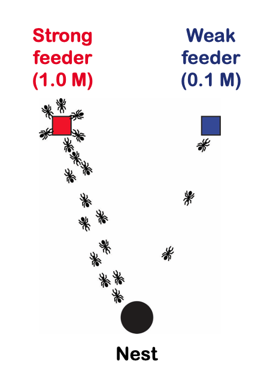
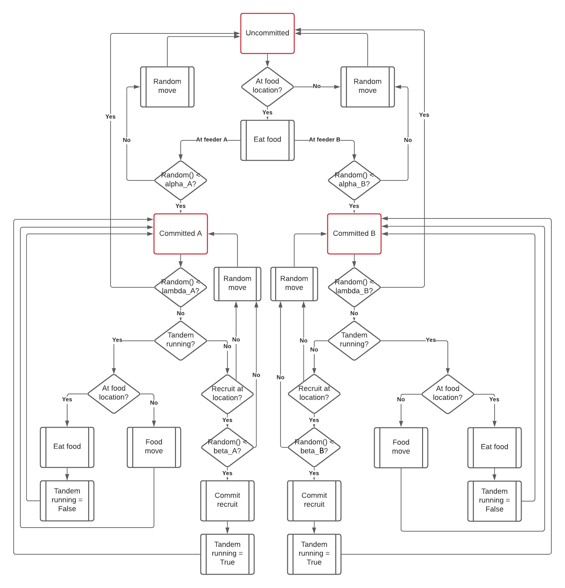
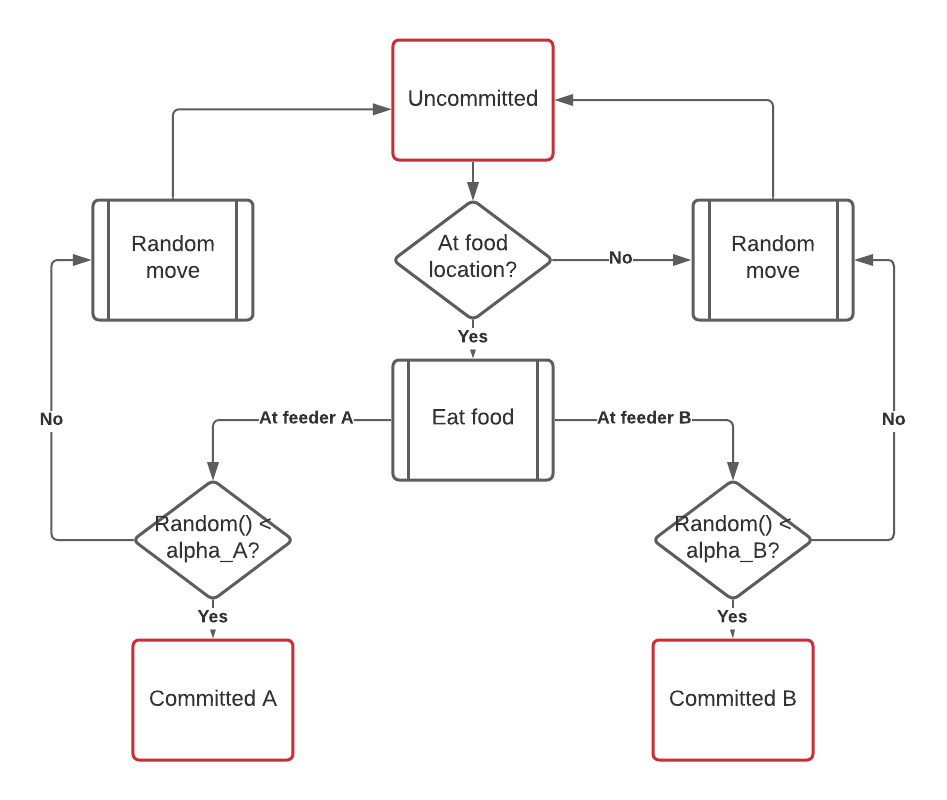
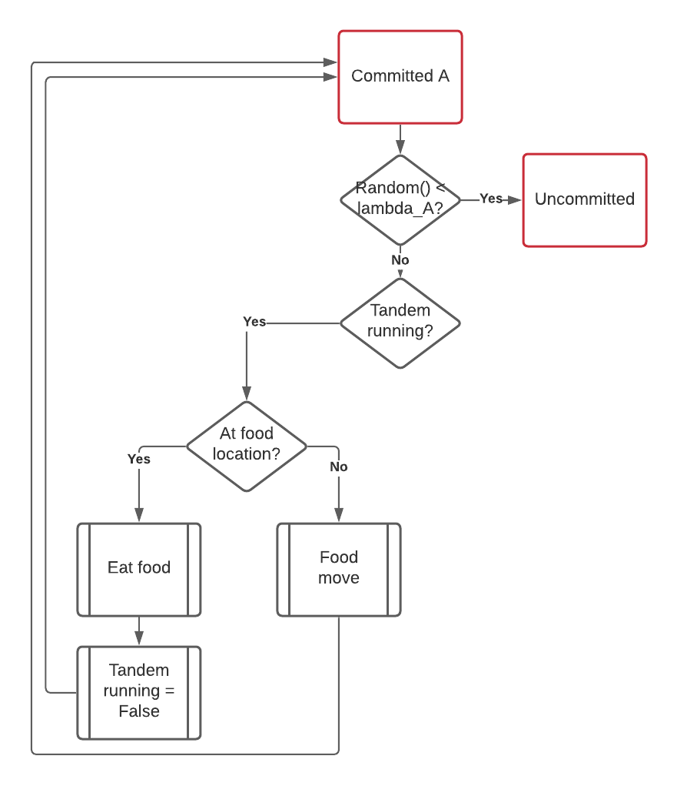
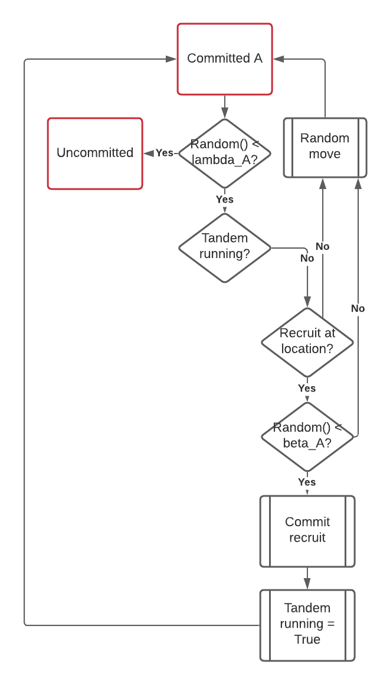
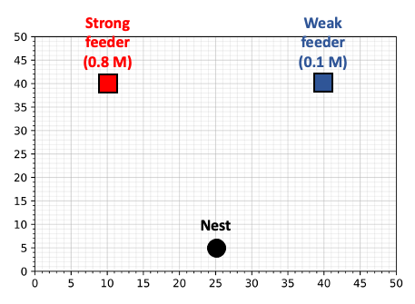
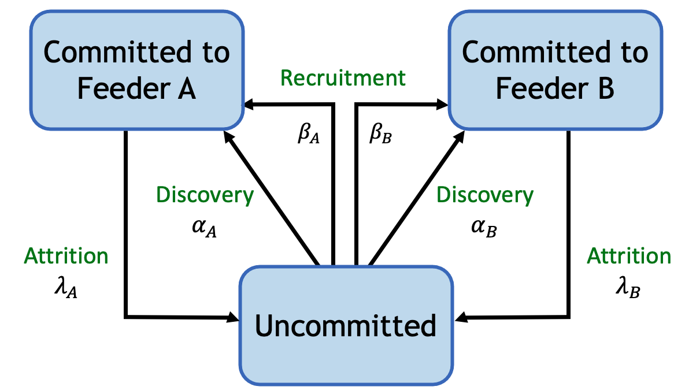
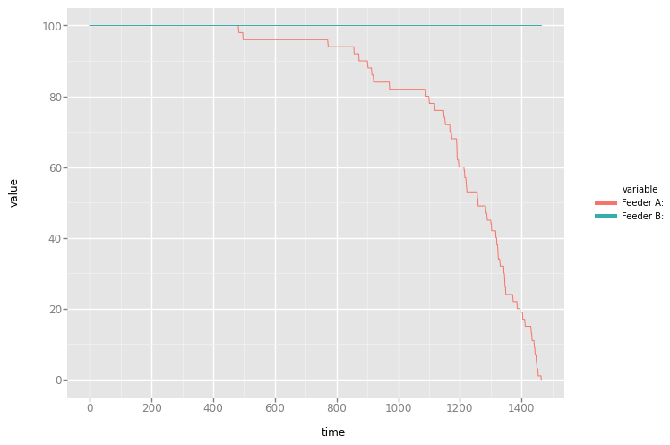

# 🐜 Social Insects and Collective Computation

## 📝 Overview
This project simulates the collective behavior of ants using a state-machine-based approach to model decision-making, recruitment, and foraging. Inspired by the principles of bio-inspired computing, it explores how simple local rules can lead to intelligent global behavior without centralized control. 

This simulation models **tandem running** and **commitment dynamics** in an ant colony choosing between two food sources of different quality. It is based on Bio-Inspired Computing and aligns with current research in **swarm intelligence**, **emergent behavior**, and **collective decision-making**.

## ✨ Key Features
- Models **uncommitted**, **committed**, and **recruiting** ant states
- Incorporates probabilistic behavior using alpha, beta, and lambda parameters
- Visualizes state transitions and feeder preferences
- Explores how swarm behavior results in optimal food source selection
- Uses biologically inspired algorithms rather than traditional AI

## 🖼️ Screenshots

**Ant Feeder Setup**  


**Full Behavioral State Diagram**  


**Phase 1 – Initial State**  


**Phase 2 – Commitment & Recruitment**  


**Phase 3 – Recruitment Dynamics**  


**Grid Layout of Nest and Feeders**  


**Simplified Transition Diagram**  


## 🧪 Technologies Used
- Python 3.10+
- HTML/CSS for data visualization
- Jupyter Notebook (optional, for experimentation)

## ⚙️ How to Build and Run
1. Clone the repository:
   ```bash
   git clone https://github.com/ChadNetwig/social-insect-collective-comp.git
   cd social-insect-collective-comp
   ```

## 📊 Visualizing the Results

A time series graph is generated to show the remaining food in each feeder over the course of the simulation.

The following chart illustrates the expected behavior: **Feeder A**, being the higher quality source, is depleted much faster than **Feeder B**, which retains nearly all of its contents. This emergent behavior reflects the ants' collective preference for higher reward stimuli.



### Explanation

- The x-axis represents the simulation time steps.
- The y-axis shows the amount of food remaining at each feeder.
- The red line tracks Feeder A (1.0 M concentration).
- The blue line tracks Feeder B (0.1 M concentration).

Simulation results are expected to resemble this pattern to be considered valid. Due to the stochastic nature of the model, results must fall within **two standard deviations** of a distribution generated over 100 runs. The test harness verifies this automatically.

The code used to generate the plot is included in the repository. Test case validation scripts are not visible.

## 📌 Important Notes
- This project models concepts from Project 5: Modeling Collective Behavior in Ants from ASU’s CSE598 Bio-Inspired Computing course.

- The biological inspiration for this project is derived from Deborah Gordon’s work on ant decision-making and collective computation.

- Related to current research in swarm robotics, biologically inspired algorithms, and self-organization.

## 📚 License
This project is licensed under the MIT License.
